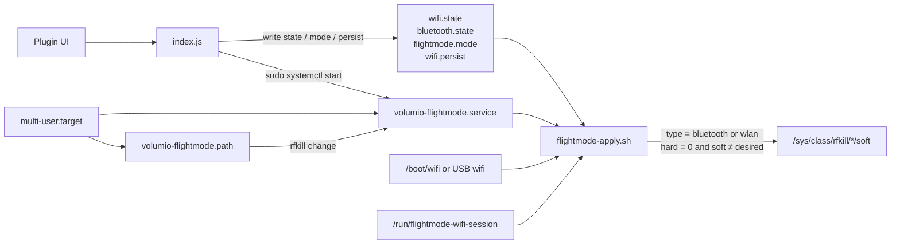
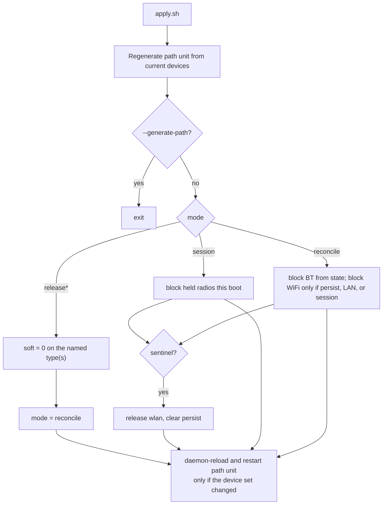
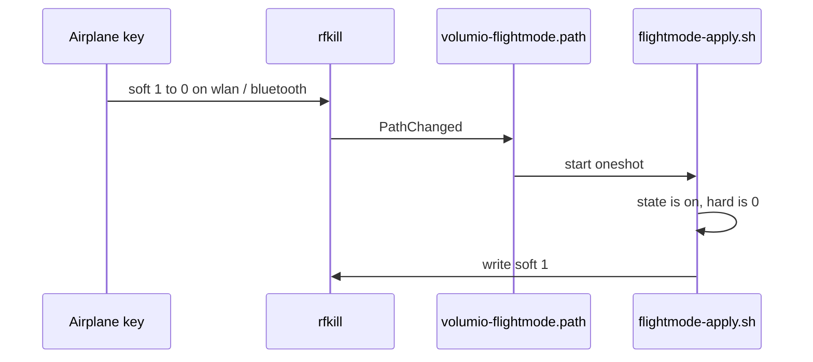
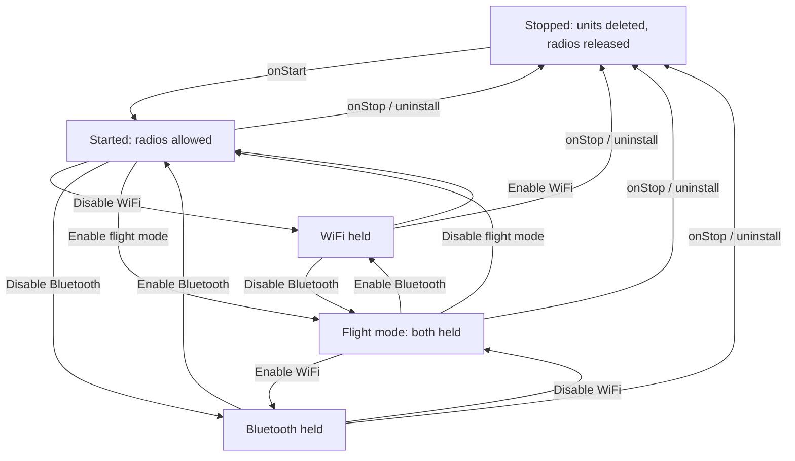

# Flight Mode

Soft-blocks WiFi and Bluetooth with rfkill. Bluetooth stays blocked across reboot. WiFi comes back after reboot unless a cable is connected or persist is unlocked.

The plugin holds every change it makes. Stop, disable, or uninstall releases the radios and deletes the units it created. No OS file is overwritten. Sudoers is not touched.

Volumio 4 / Bookworm. `amd64` and `armhf`.

## Why rfkill, not the Volumio toggles

`wireless_enabled=false` is defeated by two hotspot paths in `wireless.js`. `bluetoothctl power off` is session-scoped and loses to `AutoEnable=true` at the next boot. An rfkill soft block sits below both. Nothing on a stock image fights it: the OS `volumio_rfkill_runtime` units exist but are never enabled.

`boot_priority` cannot order a plugin against `wireless.service` or `bluetooth.service`. Enforcement is a systemd oneshot with `Before=` those units.

## Architecture



The apply script is the only writer of rfkill. Node never calls `rfkill` and never writes sysfs. Privilege is the existing `/bin/systemctl`, `/bin/ln`, and `/bin/rm` NOPASSWD entries.

Units are additive. `onStart` generates them in the plugin tree and `ln -sf` into `/etc/systemd/system`. `onStop` deletes those two symlinks. `/bin/cp` is not in sudoers, which is why they are symlinks.

## WiFi after reboot

| Situation | WiFi after reboot |
|---|---|
| No LAN, default | Comes back. Power cycle recovers. |
| LAN present | May stay off. The cable is the recovery path. |
| No LAN, persist unlocked | Stays off until Enable WiFi or Disable flight mode. |
| Sentinel present | Forced on. Persist is cleared. |

Bluetooth always persists across reboot when it is held. It does not take away the web UI.

A UI Disable WiFi or Enable flight mode writes `/run/flightmode-wifi-session` so the path unit can re-apply WiFi **this boot**. `/run` is tmpfs; after reboot that file is gone and leftover `mode=session` is treated as `reconcile`.

Reconcile applies Bluetooth from `bluetooth.state`. It applies WiFi only if `wifi.state=off` **and** (persist is on **or** a wired carrier is up **or** the session file is still present) **and** no sentinel.

## Persist unlock

Without a cable, persist is a lockout: after reboot the device is not reachable over WiFi. The web UI is gone until you recover. Use it only if the unit has a screen (or you already know how to get back in).

Volumio `askForConfirm` is OK/Cancel only. Persist without a cable is gated by a random 6-character token on this page (`ABCDEFGHJKLMNPQRSTUVWXYZ23456789`). Type it and press **Keep WiFi off across reboot**. Match is case-insensitive. Wrong code: toast and a new token.

The challenge is hidden when a cable is up (persist is allowed without it) and hidden once unlocked (a persist-active note is shown instead). Enable WiFi, Disable flight mode, plugin stop, uninstall, or a sentinel clears persist. It is not a saved password.

Recovery, in order:

1. This page, before you reboot: Enable WiFi or Disable flight mode.
2. A network cable. LAN up is enough; persist is then allowed without the challenge because the cable is the way back in.
3. An empty file named `wifi` (no extension) on a USB stick or in `/boot` (or `/boot/firmware`). See Sentinel.

## Sentinel

Headless recovery when persist was unlocked and there is no cable. Same idea as dropping `wpa_supplicant.conf` on the boot partition.

Empty file named `wifi` (size 0, no extension). First match wins:

- `/boot/wifi`
- `/boot/firmware/wifi`
- `*/wifi` directly under a mount in `/media` or `/mnt`. Do not recurse.

Presence overrides persist: release wlan, set `wifi.state=on`, clear persist. Bluetooth is left alone. The file is **not** deleted. Remove it to allow persist again.

Checked in the apply script and in `onStart`. A USB stick inserted after boot is seen on the next apply or UI action that starts the oneshot. No udev unit.

## Apply script

`scripts/flightmode-apply.sh` enumerates `/sys/class/rfkill/*/type` and keeps `bluetooth` and `wlan` only. Never by index. A USB dongle does not shift the policy.

| Invocation | Behaviour |
|---|---|
| `session` | write `/run/flightmode-wifi-session`, block each type whose `*.state` is `off` (sentinel still forces WiFi on) |
| default / `reconcile` (oneshot / path / boot) | block Bluetooth from state; block WiFi only if held **and** (persist **or** LAN **or** session file) **and** no sentinel |
| `release` / `release-wifi` / `release-bluetooth` | soft-unblock those types, then reset mode to `reconcile` |
| `--generate-path` | write the path unit and exit |

`wifi.state` and `bluetooth.state` are `on` (radio allowed) or `off` (plugin holds a block). Flight mode is both `off`. An old `flightmode.state=on` migrates to both held.

Writes are skipped when `hard=1`, or when `soft` is already the desired value (stops a path-unit loop).



A leftover `mode=session` after reboot (no `/run/flightmode-wifi-session`) is treated as `reconcile`. That is how no-LAN WiFi comes back.

Never `rfkill unblock all`. Never write `hard`.

## Airplane key

`/etc/modprobe.d/rfkill_default.conf` is left alone (`master_switch_mode=2`). An x86 airplane key that unblocks all radios is undone by the path unit.



Hard block is driver-owned. The UI shows it and greys the buttons. Software cannot clear it, so no key-detection logic is required.

The path unit is generated at start from the current device set, plus `PathChanged=/sys/class/rfkill` so a radio appearing later regenerates the watch list.

## Lifecycle

The plugin is either stopped or started. Radio holds live inside Started. Flight mode is not a third plugin state: it is both radios held.



`wifi.state` / `bluetooth.state` are `on` (allowed) or `off` (held). Both `off` is flight mode.

Bluetooth hold survives reboot while the plugin remains enabled. WiFi hold survives reboot only with LAN or persist; otherwise it is this-boot only. A sentinel forces WiFi allowed and clears persist. Disable the plugin and every hold is gone.

`uninstall.sh` repeats the same teardown as `onStop` and is idempotent. The plugin manager always calls `onStop` first.

## UI

One plugin page. No Save button on the radio sections. Four blocks:

- Status, radios, and network recovery line
- Disable / Enable WiFi and Bluetooth
- Persist challenge (no LAN only): type the on-screen code
- Disable / Enable flight mode (sets both)

Flight mode on means both radios are held. Enabling one radio turns flight mode off and leaves the other held. Status, per-radio soft/hard, and whether a cable is up are filled in `getUIConfig`. Enable flight mode and disable WiFi ask for confirm (ethernet vs lockout vs persist wording). A hard block hides the buttons for that radio.

Default no-LAN lockout is session-only. A reboot brings WiFi back. Persist is the extra option for a device with a screen (OneUp 40 / Gole2). The `wireless.js` emergency hotspot override will still run and will fail against a session or persist block. That is disclosed, not engineered away.

`network/config.json` is not written. It is not this plugin’s file to restore.

## What this plugin does not do

- No `volumio-os` commit
- No `sudoers.d` drop-in
- No edit of `rfkill_default.conf`, `wireless.js`, `main.conf`, or `bluetooth.service`
- No `has_configuration` / My Music registration
- No System-page UI contributor (the hook exists; Network has none)
- No 10-minute grace timer
- No udev/hotplug unit for a USB sentinel

## Tree

```
flightmode/
  index.js
  UIConfig.json
  config.json
  install.sh              chmod +x the apply script only
  uninstall.sh            same teardown as onStop
  scripts/flightmode-apply.sh
  units/volumio-flightmode.service.in
  units/volumio-flightmode.path.in
  i18n/strings_{en,de,fr,it,es,nl,pl,pt,sv,da,no,fi,cz}.json
```

Generated and gitignored: `units/volumio-flightmode.service`, `units/volumio-flightmode.path`, `wifi.state`, `bluetooth.state`, `flightmode.state`, `flightmode.mode`, `wifi.persist`.

Runtime only: `/run/flightmode-wifi-session`.

## Check on device

```sh
/usr/sbin/rfkill list
systemctl is-enabled volumio-flightmode.service volumio-flightmode.path
ls -l /etc/systemd/system/volumio-flightmode.*
cat /data/plugins/system_controller/flightmode/wifi.state
cat /data/plugins/system_controller/flightmode/bluetooth.state
cat /data/plugins/system_controller/flightmode/wifi.persist
```

After disable or uninstall those two unit files must be gone and the radios unblocked.

## Testing

Empty file `/data/flightmode` (size 0). When present, treat LAN as down even if ethernet has carrier. Used on hanger to exercise the challenge, persist, and reboot-WiFi-returns without pulling the cable. A directory or a non-empty file is ignored. Not shown in the UI.

```sh
touch /data/flightmode
# exercise Disable WiFi / persist / reboot
rm /data/flightmode
```

Sentinel check (do not delete the file from the plugin; remove it yourself when done):

```sh
touch /boot/wifi
# next apply or UI action should force WiFi on and clear persist
rm /boot/wifi
```
