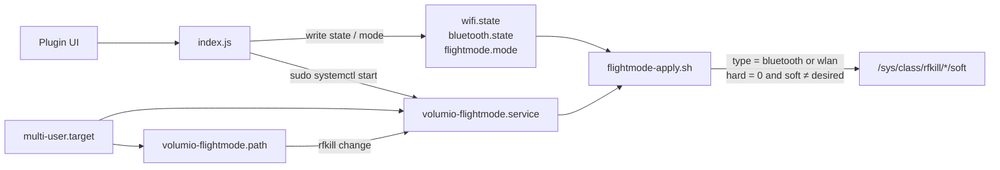
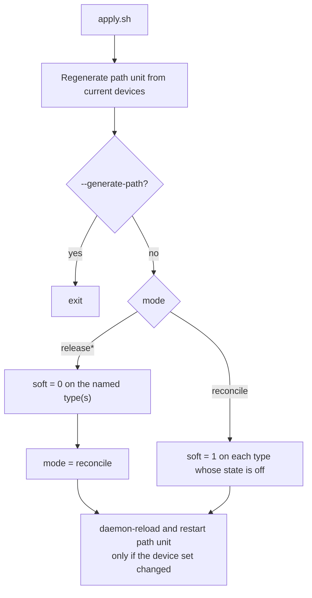
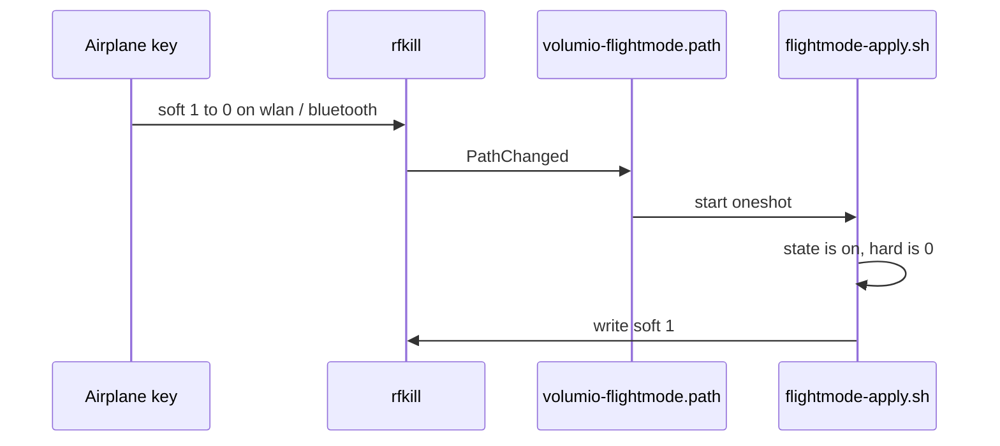
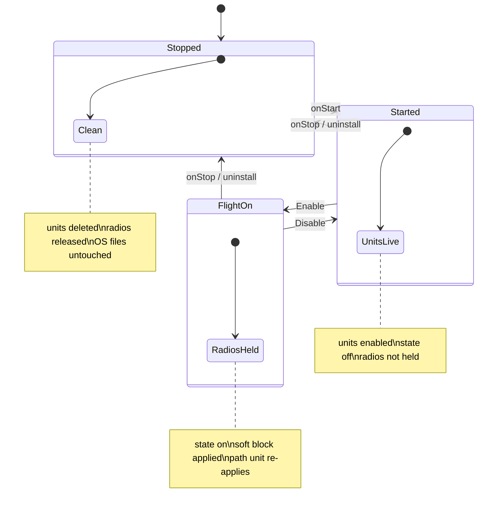

# Flight Mode

Soft-blocks WiFi and Bluetooth with rfkill and keeps them blocked across reboot.

The plugin holds every change it makes. Stop, disable, or uninstall releases the radios and deletes the units it created. No OS file is overwritten. Sudoers is not touched.

Volumio 4 / Bookworm. `amd64` and `armhf`.

## Why rfkill, not the Volumio toggles

`wireless_enabled=false` is defeated by two hotspot paths in `wireless.js`. `bluetoothctl power off` is session-scoped and loses to `AutoEnable=true` at the next boot. An rfkill soft block sits below both. Nothing on a stock image fights it: the OS `volumio_rfkill_runtime` units exist but are never enabled.

`boot_priority` cannot order a plugin against `wireless.service` or `bluetooth.service`. Enforcement is a systemd oneshot with `Before=` those units.

## Architecture



The apply script is the only writer of rfkill. Node never calls `rfkill` and never writes sysfs. Privilege is the existing `/bin/systemctl`, `/bin/ln`, and `/bin/rm` NOPASSWD entries.

Units are additive. `onStart` generates them in the plugin tree and `ln -sf` into `/etc/systemd/system`. `onStop` deletes those two symlinks. `/bin/cp` is not in sudoers, which is why they are symlinks.

## Apply script

`scripts/flightmode-apply.sh` enumerates `/sys/class/rfkill/*/type` and keeps `bluetooth` and `wlan` only. Never by index. A USB dongle does not shift the policy.

| Invocation | Behaviour |
|---|---|
| default (oneshot / path / boot) | soft-block each type whose `*.state` is `off` |
| `release` / `release-wifi` / `release-bluetooth` | soft-unblock those types, then reset mode to `reconcile` |
| `--generate-path` | write the path unit and exit |

`wifi.state` and `bluetooth.state` are `on` (radio allowed) or `off` (plugin holds a block). Flight mode is both `off`. An old `flightmode.state=on` migrates to both held.

Writes are skipped when `hard=1`, or when `soft` is already the desired value (stops a path-unit loop).



Default with state `off` does not unblock. That is deliberate: a path trigger while flight mode is off must not fight an airplane key or `headless_wireless.service`. Unblock happens only on an explicit `release` (user Disable, plugin stop, uninstall).

Never `rfkill unblock all`. Never write `hard`.

## Airplane key

`/etc/modprobe.d/rfkill_default.conf` is left alone (`master_switch_mode=2`). An x86 airplane key that unblocks all radios is undone by the path unit.



Hard block is driver-owned. The UI shows it and greys the buttons. Software cannot clear it, so no key-detection logic is required.

The path unit is generated at start from the current device set, plus `PathChanged=/sys/class/rfkill` so a radio appearing later regenerates the watch list.

## Lifecycle



Flight mode survives reboot only while the plugin remains enabled. That is also the recovery path: disable the plugin and the hold is gone.

`uninstall.sh` repeats the same teardown as `onStop` and is idempotent. The plugin manager always calls `onStop` first.

## UI

One plugin page. No Save button. Three controls:

- Disable / Enable WiFi
- Disable / Enable Bluetooth
- Disable / Enable flight mode (sets both)

Flight mode on means both radios are held. Enabling one radio turns flight mode off and leaves the other held. Status, per-radio soft/hard, and whether a cable is up are filled in `getUIConfig`. Enable flight mode and disable WiFi ask for confirm (ethernet vs lockout wording). A hard block hides the buttons for that radio.

Lockout is allowed. A laptop in a seat has no ethernet; that is the primary use. The confirm states that recovery is only from the local screen, or by disabling the plugin. The `wireless.js` emergency hotspot override will still run and will fail against the block. That is disclosed, not engineered away.

`network/config.json` is not written. It is not this plugin’s file to restore.

## What this plugin does not do

- No `volumio-os` commit
- No `sudoers.d` drop-in
- No edit of `rfkill_default.conf`, `wireless.js`, `main.conf`, or `bluetooth.service`
- No `has_configuration` / My Music registration
- No System-page UI contributor (the hook exists; Network has none)

## Tree

```
flightmode/
  index.js
  UIConfig.json
  config.json
  install.sh              chmod +x the apply script only
  uninstall.sh            same teardown as onStop
  scripts/flightmode-apply.sh
  units/volumio-flightmode.service.in
  units/volumio-flightmode.path.in
  i18n/strings_{en,de,fr,it,es,nl,pl,pt,sv,da,no,fi,cz}.json
```

Generated and gitignored: `units/volumio-flightmode.service`, `units/volumio-flightmode.path`, `wifi.state`, `bluetooth.state`, `flightmode.state`, `flightmode.mode`.

## Install and submit

Run this on the Volumio device. `volumio plugin install` and `volumio plugin submit` are device commands. Remove `node_modules` before the commit so they are not pushed or packed.

```sh
git clone git@github.com:volumio/volumio-plugins-sources-bookworm.git --depth=1
cd volumio-plugins-sources-bookworm
git checkout -b flightmode
cd flightmode

# --- update code first ---

volumio plugin install
rm -Rf node_modules

cd ..

git add flightmode
git commit -m 'Flight Mode - Initial release'
git push origin flightmode

cd -
volumio plugin submit
```

`git add flightmode` only. Do not `git add *` from the repo root.

## Check on device

```sh
/usr/sbin/rfkill list
systemctl is-enabled volumio-flightmode.service volumio-flightmode.path
ls -l /etc/systemd/system/volumio-flightmode.*
```

After disable or uninstall those two unit files must be gone and the radios unblocked.
